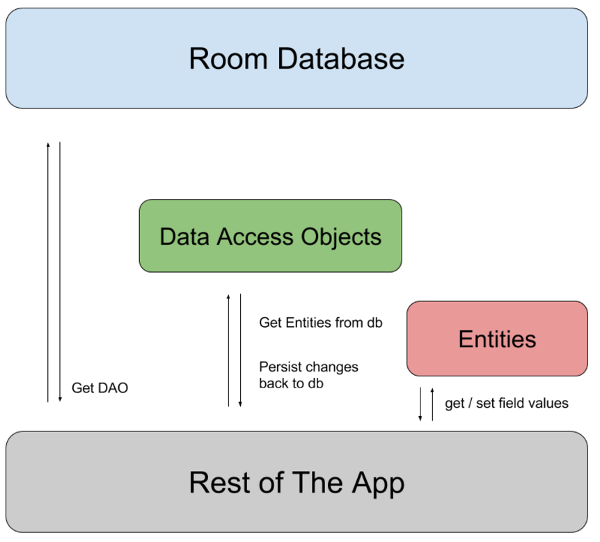

### ROOM Codelabs 
[1. Persist data with Room](https://developer.android.com/codelabs/basic-android-kotlin-compose-persisting-data-room#0)
[2. Read and update data with Room](https://developer.android.com/codelabs/basic-android-kotlin-compose-update-data-room?hl=en#0)

[(Deprecated) Advanced Android in Kotlin 05.1:Testing Basics](https://developer.android.com/codelabs/advanced-android-kotlin-training-testing-basics?index=..%2F..index#0)

* Умение создавать базовый пользовательский интерфейс (UI) для приложения Android с помощью Jetpack Compose.
* Возможность использования составных элементов, таких как Text, Icon, IconButton, и LazyColumn.
* Возможность использования компоновки  **NavHost** для определения маршрутов и экранов в вашем приложении.
* Возможность навигации между экранами с помощью **NavHostController**.
* Знакомство с компонентом архитектуры Android **ViewModel**. Умение использовать **ViewModelProvider.Factory** для создания экземпляров ViewModels.
* Знакомство с основами параллелизма.
* Возможность использования **сопрограмм** для длительных задач.
* Базовые знания баз данных **SQLite** и языка **SQL**

$ git clone https://github.com/google-developer-training/basic-android-kotlin-compose-training-inventory-app.git
$ cd basic-android-kotlin-compose-training-inventory-app
$ git checkout starter


> Примечание : для зависимостей библиотек в вашем файле Gradle всегда используйте самые последние номера стабильных версий страницы релизов AndroidX .
> [страницы релизов AndroidX](https://developer.android.com/jetpack/androidx/versions).



Следующие три компонента [Room](https://developer.android.com/topic/libraries/architecture/room)  делают эти рабочие процессы бесперебойными.

[Сущности Room, **ENTITY**](https://developer.android.com/training/data-storage/room/defining-data) представляют собой таблицы в базе данных вашего приложения. Вы используете их для обновления данных, хранящихся в строках таблиц, и для создания новых строк для вставки.
[Room DAO](https://developer.android.com/training/data-storage/room/accessing-data) предоставляют методы, которые ваше приложение использует для извлечения, обновления, вставки и удаления данных в базе данных.
Класс [Room Database class](https://developer.android.com/reference/kotlin/androidx/room/Database)  — это класс базы данных, который предоставляет вашему приложению экземпляры DAO, связанных с этой базой данных.

KSP — это мощный и в то же время простой API для анализа аннотаций Kotlin.
```
build.gradle.kts (project)
plugins {
    alias(libs.plugins.ksp) apply false
--------------------------------------------
build.gradle.kts (module)
plugins {
    alias(libs.plugins.ksp)
...
dependencies {
    ksp(libs.androidx.room.compiler)
    implementation(libs.androidx.room.ktx)
--------------------------------------------
libs.versions.toml
[versions]
ksp = "2.1.20-2.0.0"
room = "2.7.0"

[libraries]
androidx-room-compiler = { module = "androidx.room:room-compiler", version.ref = "room" }
androidx-room-ktx = { module = "androidx.room:room-ktx", version.ref = "room" }
...
[plugins]
ksp = { id = "com.google.devtools.ksp", version.ref = "ksp" }

```


## ROOM

### Entity

Класс [Entity](https://developer.android.com/reference/androidx/room/Entity) определяет таблицу, и каждый экземпляр этого класса представляет строку в таблице базы данных.


- Аннотация `@Entity` отмечает класс как класс Entity базы данных.
- Для каждого Entity класса приложение создает таблицу базы данных. 
- Каждое поле Entity представлено как столбец в базе данных, если не указано иное (см. документацию Entity для получения подробной информации).
- Каждый экземпляр сущности, хранящийся в базе данных, должен иметь первичный ключ. <br>
Первичный ключ используется для уникальной идентификации каждой записи/входа в таблицах базы данных.  <br> 
После того, как приложение назначает первичный ключ, его нельзя изменить; он представляет объект сущности, пока он существует в базе данных.

В этой задаче вы создадите класс Entity и определите поля для хранения следующей информации об инвентаре для каждого товара: 
- Int -  для хранения первичного ключа (id)
- String - для хранения названия товара (name)
- double - для хранения цены товара (price)
- Int - для хранения количества на складе (quality).

`data/Item` - сущность базы данных в вашем приложении.

* Обозначить класс, как data class с помощью ключевого слова data.
* Добавить аннотацию для классификации класса, как @Entity базы данных.
* Добавить первичный ключ для каждого экземпляра сущности.
* Назначьте id значение по умолчанию 0, которое необходимо для автоматической генерации id значений.
*
* По умолчанию (без аргументов для @Entity) имя таблицы совпадает с именем класса.
* Задать имя таблицы, как "items", с помощью параметра tableName.
*
* Можно назначить имя столбцу с помощью параметра @ColumnInfo.

[Документация Entity](https://developer.android.com/reference/androidx/room/Entity)

Когда класс помечен как Entity, все его свойства сохраняются. Если вы хотите исключить некоторые из его свойств, вы можете пометить их как Ignore.
Если свойство равно transient, оно автоматически игнорируется, если только оно не помечено как ColumnInfo, Embedded или Relation.

#### Классы данных

[**Классы данных**](https://kotlinlang.org/docs/data-classes.html) в основном используются для хранения данных в Kotlin. 
Они определяются ключевым словом **data**. 

Объекты классов данных Kotlin имеют некоторые дополнительные преимущества. 
Например, компилятор автоматически генерирует утилиты для сравнения, печати и копирования, такие как toString(), copy()и equals().
Чтобы обеспечить согласованность и осмысленное поведение сгенерированного кода, классы данных должны соответствовать следующим требованиям:

* Основной **конструктор** должен иметь хотя бы один параметр.
* Все основные параметры конструктора должны быть **val** или **var**.
* Классы данных **не** могут быть **abstract, open, или sealed**.

> Компилятор использует только свойства, определенные внутри основного конструктора для автоматически сгенерированных функций. Компилятор исключает свойства, объявленные внутри тела класса, из сгенерированных реализаций.

```kotlin
// Example data class with 2 properties.
data class User(val firstName: String, val lastName: String){
}
```

_**Теперь, когда вы создали класс Entity, вы можете создать объект доступа к данным (DAO) для доступа к базе данных.**_


### DAO

Если Entity - описывает структуры базы данных, то DAO описывает действия с ней.

Data Access Object - это интерфейс, который предоставляет методы для взаимодействия с данными в базе данных.


DAO - промежуточный слой. 
Мы сами **объявляем там те функции**, которые будем вызывать из приложения для работы с данными. 
И с помощью аннотаций (@Insert, @Delete, @Update, @Query), каждой такой функции мы ставим в соответствие **SQL запрос к базе данных**.
Это позволяет разделить слой данных и код, который эти данные использует.

Создаваемый вами DAO — это пользовательский интерфейс, который предоставляет удобные методы для запроса/извлечения, вставки, удаления и обновления базы данных. Room генерирует реализацию этого класса во время компиляции.

В качестве дополнительного бонуса, когда вы пишете запросы в Android Studio, компилятор проверяет ваши SQL-запросы на наличие синтаксических ошибок.

> Для приложения «Инвентаризация» вам необходимо иметь возможность выполнять следующие действия:
> - **Вставить** или добавить новый элемент.
> - **Обновить** существующий товар, - обновить название, цену и количество.
> - **Получить** определенный элемент на основе его первичного ключа id.
> - **Собрать все предметы в лист**, чтобы вы могли их продемонстрировать.
> - **Удалить** запись в базе данных.

Например, для вставки элементов, в интерфейс ItemDao вы добавите функцию:
```kotlin
        @Insert(onConflict = OnConflictStrategy.IGNORE)
        suspend fun insert(item: Item)
```


fun insert(item: Item) вы вызовете в вашем приложении. <br>
@Insert(onConflict = OnConflictStrategy.IGNORE) - позволит сгенерировать код SQL-запроса для вставки сущности в базу данных. <br>
Параметр onConflict = OnConflictStrategy.IGNORE - определяет стратегию разрешения конфликтов, здесь - запрос вставки нового элемента игнорируется, если его первичный ключ (PrimaryKey) уже существует в базе данных.

В пакете data создайте интерфейс ItemDao.kt.
```kotlin
    import androidx.room.Dao
    
    @Dao
    interface ItemDao {
        //При вставке элементов в базу данных могут возникнуть конфликты. 
        // Например, несколько мест в коде пытаются обновить сущность с разными, конфликтующими значениями, такими как один и тот же первичный ключ. 
        // В приложении Inventory мы вставляем сущность только из одного места, механизм разрешения конфликтов - игнорирование.
        @Insert(onConflict = OnConflictStrategy.IGNORE)
        suspend fun insert(item: Item)

        //Аннотация удаляет элемент или список элементов.
        @Delete
        suspend fun delete(item: Item)

        //Объявляем функцию и задаём SQL запрос, который ей соответствует, здесь - обновляем элемент с заданным id.
        @Query("SELECT * from items WHERE id = :id")
        fun getItem(id: Int): Flow<Item>

        //Запрос SQL возвращает все столбцы таблицы item, упорядоченные по возрастанию.
        @Query("SELECT * from items ORDER BY name ASC")
        fun getAllItems(): Flow<List<Item>>
    }
```

Как получить значения из базы данных?
Рекомендуется использовать Flow, для получения данных из базы. Главной особенностью Flow является то, что он генерирует уведомление всякий раз, когда данные в базе данных изменяются. 

Это означает, что вам нужно получить объект потока Flow только один раз. 
Затем, когда вы получите оповещение об обновления данных, вы используете этот объект для получения данных. 
Кроме того, передача данных выполняется в фоновом потоке. 

### База данных

[RoomDatabase](https://developer.android.com/reference/androidx/room/RoomDatabase) использует ваш Entity и DAO.
Класс [Database](https://developer.android.com/reference/androidx/room/Database) предоставляет экземпляры DAO. 

Вам нужно создать абстрактный класс RoomDatabase и аннотировать его с помощью @Database. 
Мы используем его для того, чтобы получить экземпляр базы данных. 
И, кроме того, мы должны реализовать Singleton- стратегию, чтобы предотвратить одновременное открытие нескольких экземпляров базы данных.

Примечание : 
Обычно вы предоставляете объект [миграции](https://medium.com/androiddevelopers/understanding-migrations-with-room-f01e04b07929) со стратегией миграции для случаев изменения схемы. 
Объект миграции — это объект, который определяет, как вы берете все строки со старой схемой и преобразуете их в строки в новой схеме, чтобы не потерять данные. 
Миграция выходит за рамки этой кодовой лаборатории, но этот термин относится к случаю, когда схема изменяется, и вам нужно переместить дату, не теряя данные. 
Поскольку это пример приложения, простой альтернативой является уничтожение и перестроение базы данных, что означает потерю данных инвентаризации. 
Например, если вы что-то меняете в классе сущности, например добавляете новый параметр, вы можете разрешить приложению удалить и повторно инициализировать базу данных.


### Реализуем репозиторий

Источников данных может быть несколько, нам удобно создать общие правила для работы с ними - интерфейс. 
ItemsRepository.kt

Затем, напишем класс, который работает с локальной базой данных OfflineItemsRepository.

А потом, нам нужен способ создания этого репозитория.

Создадим еще интерфейс AppContainer, предоставляющий ItemsRepository, это понадобиться для инжекции кода
И реализуем его в классе AppDataContainer.

Теперь нам нужен слой данных для работы с представлениями. Изменим модели ViewModel,
Все операции с базой данных должны выполняться вне основного потока пользовательского интерфейса; вы делаете это с помощью сопрограмм и viewModelScope.

